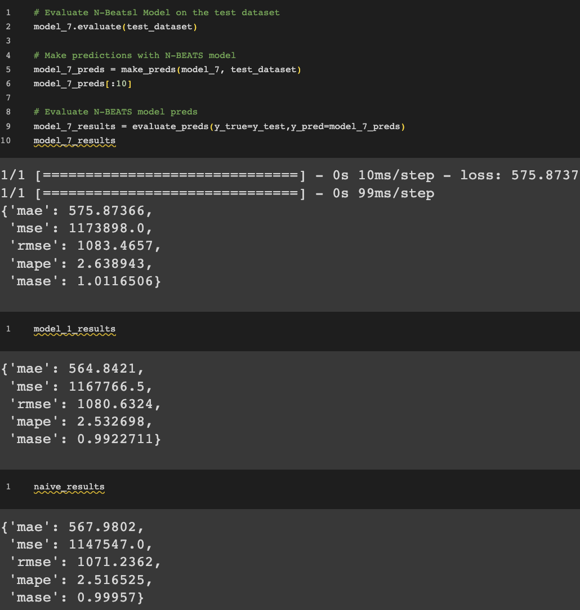
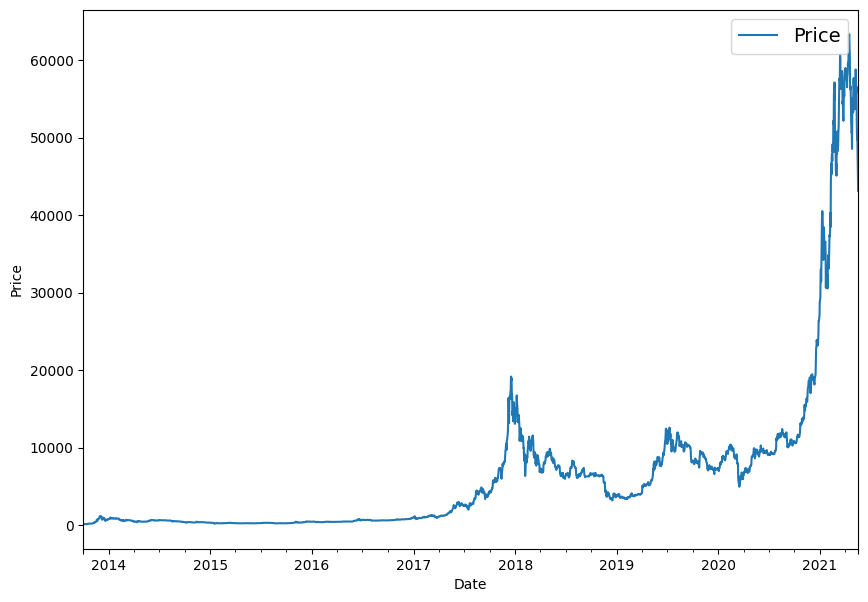
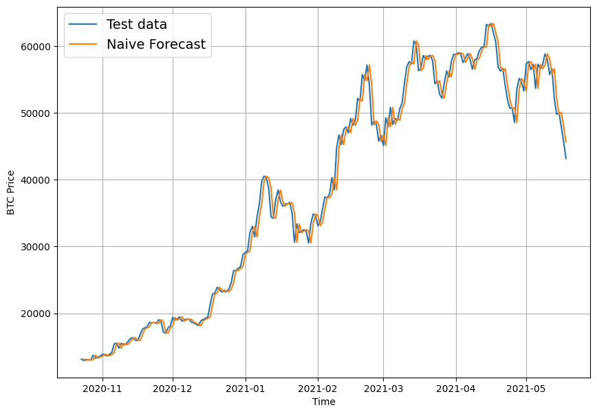
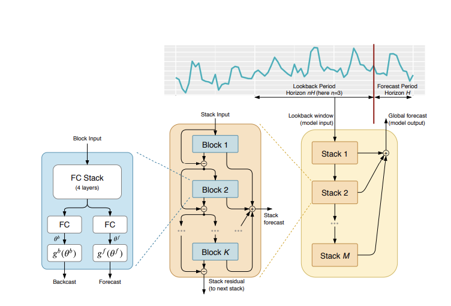

# tensorflow-mastery
A repository showcasing the exploration of the practical uses of tensorflow. 
- [Predicting Bitcoin Prices: Comparing Naive Bayes vs. N-BEATS](./Predicting_Bitcoin_Prices_Naive_Bayes_vs_N_Beats_modeling.ipynb)

## Results
The naive results outperform the N-Beats algorithm (model_7) and a 128 layer neural network (model_1). 

## Historical Bitcoin Prices

## Naive Bayes Forcast of Bitcoin Prices

## N-Beats Algorithm for Bitcoin Price Prediction

